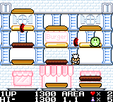
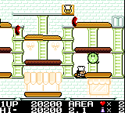
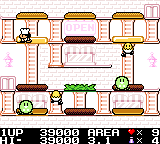
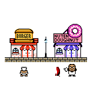

# Burger Time Deluxe colorization mod
Sourcecode for Game Boy **Burger Time Deluxe** colorization hack.

 
 
 
 

## How to compile
1. Download and install [RGBDS](https://github.com/rednex/rgbds/)
2. Place `BurgerTime Deluxe (World).gb` ROM (crc32: `88219a49`) in `src/original_rom/` folder and rename it to `burger_time_deluxe.gb`
4. Run `make` (Unix) or `make_win.bat` (Windows), it will create `bin/burger_time_deluxe_dx.gbc`
